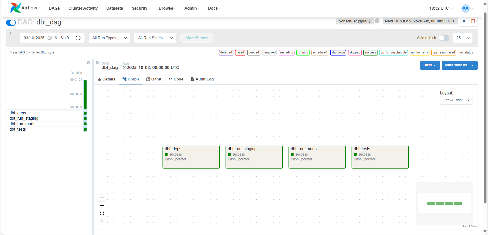

# Knok Care: A Case Study

This repository is part of a challenge proposed during the interview process.

project/
│
├── airflow/
│
├── notebooks/ # Contains code regarding the 3 exercises
│
├── sql/ # Contains queries and the resulting tables in a .txt file
│
└── pdf/ # Containes the EDA report

To run the sql queries: psql -U postgres -d knok -f knok_queries.sql > query_results.txt

# Updates (03/10): Appointment Data ETL & Analytics

## Overview

This project demonstrates a **modern data workflow** for teleconsultation data using **Airflow**, **dbt**, and **PostgreSQL**.

The goal is to show **how raw data can be transformed into knowledge** for reliable continuous analysis, answering the needs of collaborative teams.

---

## Why Airflow

* **Orchestration**: Airflow manages the execution of tasks in order (`staging → marts → tests`) automatically.
* **Scheduling**: Enables recurring runs (e.g., daily), ensuring data is always up to date.
* **Reliability**: Handles retries, logging, and monitoring so pipelines are robust.
* **Decoupling**: Allows independent steps to run separately, making debugging easier.

---

## Why dbt

* **Transformation as code**: Centralizes SQL transformations with clear versioning.
* **Data modeling**: Separates **staging models** (clean, standardized data) from **marts** (aggregates for analysis).
* **Materializations**: Controls whether models are ephemeral, views, or tables, balancing performance and storage.
* **Reproducibility & testing**: dbt ensures that data transformations can be validated and rerun reliably.

---

## Conceptual Workflow

1. **Raw Data** (`appointments_clean`)

   * Contains all appointment records, may have missing or inconsistent values.

2. **Staging** (`stg_appointments`)

   * Normalizes categories, converts types, and adds metadata.
   * Ensures downstream models work with **clean, consistent data**.

3. **Marts** (`mart_avg_duration_by_hour`, etc.)

   * Aggregates data for analysis and reporting.
   * Materialized as tables for performance and reproducibility.

4. **Analysis**

   * Python notebooks query marts to validate transformations, check aggregates, and explore insights.

---

## Key Takeaways

* Airflow and dbt together create a **robust, maintainable ETL pipeline**.
* Staging improves **data quality**, marts improve **analytical readiness**.
* The workflow demonstrates **modern data engineering principles**: reproducibility, modularity, scheduling, and testing.

